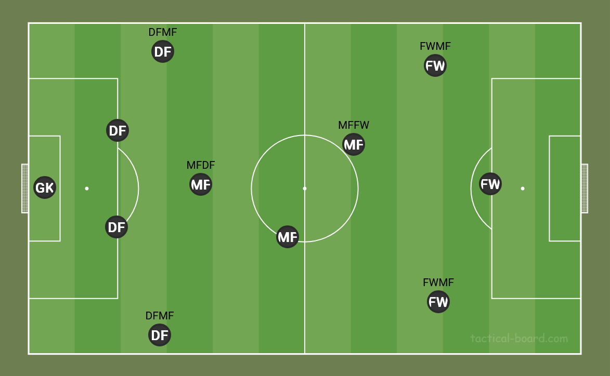

# Posições no Brasileirão pelas estatísticas dos jogadores

**Classificação com MLP e mapeamento com SOM**

Dá para descobrir a posição de um jogador só olhando para o que ele faz em campo (gols, cruzamentos, desarmes, faltas…)? Este repositório responde essa pergunta de dois jeitos, com os jogadores do **Brasileirão Série A 2025**:

- **MLP (supervisionado):** a rede recebe as 9 estatísticas por 90 minutos de um jogador e responde a posição dele: goleiro, defensor, meio-campista, meia-atacante ou atacante.
- **SOM (não supervisionado):** o mapa organiza os jogadores por estilo de jogo **sem ver a posição**. Depois a posição real é projetada sobre o mapa, para ver se ele a recuperou sozinho.

Trabalhos da disciplina **Machine Learning e Deep Learning**, ministrada pela professora Polyana Santos Fonseca Nascimento.

**Equipe:** Gabriel Costa de Miranda, João Pedro Silva da Silva e Yago Patrick Schnorr Pinto.

---

## Resultados em resumo

| | MLP | SOM |
|---|---|---|
| Tarefa | prever a posição (5 classes) | agrupar por estilo de jogo, sem a posição |
| Resultado | **F1-macro 0.715** e accuracy 0.672 no teste (122 jogadores) | mapa 14×14 com erro topográfico 0.0066; 4 clusters; 78% dos jogadores caem num neurônio da sua posição |
| Fácil | goleiro (F1 0.90) e atacante (F1 0.80) | goleiros e atacantes formam regiões próprias |
| Difícil | defensor × meio-campista: 22 dos 40 erros no teste | defensores e meio-campistas dividem o maior cluster (122 DF e 120 MF) |

As duas abordagens tropeçam no mesmo ponto: com essas estatísticas, **defensores e meio-campistas fazem quantidades parecidas das mesmas ações** (desarmes, faltas, interceptações). A análise da MLP mostra que o limite está nos dados, não no modelo. Uma rede fixa, sem nenhuma busca, já chegava a 0.680 na validação cruzada, contra 0.686 a 0.689 depois da busca. E até uma rede sem não linearidade fica só 0.04 abaixo da melhor.

---

## Dados

**Fonte:** [FBref](https://fbref.com/), tabelas *Standard Stats* e *Miscellaneous Stats* dos jogadores da Série A 2025 (20 clubes, 761 linhas).

**Tratamento** (`eda.ipynb` e `data_cleaning.ipynb`):

1. Junção das duas tabelas em `data/raw/player-stats.csv`.
2. Jogadores que atuaram por dois clubes na temporada viram uma linha só, com as estatísticas somadas.
3. Ficam só os jogadores com **mais de 180 minutos** (2 jogos completos). Com poucos minutos, as taxas por 90 viram ruído: um único gol em 20 minutos vira 4.5 gols por jogo. Até o corte de 180 min, a dispersão das taxas cai 33%; depois disso, cada aumento do corte reduz no máximo 2,5% e só tira mais jogadores da base.
4. As contagens são convertidas em **taxas por 90 minutos**.
5. Saem as colunas raras (`PK`, `PKatt`, `CrdR`, `2CrdY`, `OG`): de 86% a 96% de zeros e assimetria acima de 3.

Resultado: **606 jogadores × 9 estatísticas** (`data/processed/player-stats-model.csv`).

### Estatísticas usadas (todas por 90 minutos)

| Coluna | Significado |
|---|---|
| `Gls` | gols |
| `Ast` | assistências |
| `CrdY` | cartões amarelos |
| `Fls` | faltas cometidas |
| `Fld` | faltas sofridas |
| `Off` | impedimentos |
| `Crs` | cruzamentos |
| `Int` | interceptações |
| `TklW` | desarmes bem-sucedidos |

### Alvo: 5 posições

O FBref usa 8 rótulos de posição, incluindo 4 híbridos (como `DFMF`, defensor que também atua no meio).



A hipótese H4 da EDA comparou cada posição híbrida com a posição "pura" (teste de Mann-Whitney nas 9 estatísticas). Só o `MFFW` (meia-atacante) é diferente do `MF` em **todas as 9**, com amostra suficiente (61 jogadores). Por isso ele virou classe própria. Os outros híbridos têm poucos jogadores (26 a 29) e foram agrupados na posição principal: `DFMF` → `DF`, `MFDF` → `MF` e `FWMF` → `FW`.

| Classe | Posição | Jogadores | % |
|---|---|---|---|
| `MF` | meio-campista | 219 | 36,1 |
| `DF` | defensor | 198 | 32,7 |
| `FW` | atacante | 84 | 13,9 |
| `MFFW` | meia-atacante | 61 | 10,1 |
| `GK` | goleiro | 44 | 7,3 |

---

## Estrutura do repositório

```
.
├── data/
│   ├── raw/                          # tabelas do FBref e a junção das duas
│   └── processed/                    # dataset limpo, matriz de features e clusters do SOM
├── images/                           # posições no campo
├── models/                           # modelos finais (MLP e SOM) em .pkl
├── notebooks/
│   ├── eda.ipynb                     # junção dos dados e hipóteses H1 a H4
│   ├── data_cleaning.ipynb           # limpeza, filtro, taxas por 90 e alvo de 5 classes
│   ├── target-kmeans-clustering.ipynb  # KMeans exploratório (apoio ao SOM)
│   ├── MLP/
│   │   ├── mlp.ipynb                 # trabalho da MLP
│   │   └── results/                  # gerado ao rodar (ignorado pelo git)
│   └── SOM/
│       └── som.ipynb                 # trabalho do SOM
├── requirements.txt
└── LICENSE
```

| Notebook | O que faz | Lê | Gera |
|---|---|---|---|
| `eda.ipynb` | junta as duas tabelas e testa as hipóteses H1 a H4 | `data/raw/player-standard-stats.csv`, `data/raw/player-miscellaneous-stats.csv` | `data/raw/player-stats.csv` |
| `data_cleaning.ipynb` | limpeza, filtro de minutos, taxas por 90 e alvo | `data/raw/player-stats.csv` | `data/processed/player-stats-clean.csv`, `data/processed/player-stats-model.csv` |
| `target-kmeans-clustering.ipynb` | escolhe as features e explora quantos grupos existem entre os jogadores de linha | `data/processed/player-stats-clean.csv` | — |
| `MLP/mlp.ipynb` | busca de hiperparâmetros, sensibilidade e modelo final | `data/processed/player-stats-model.csv` | `models/modelo_final.pkl`, `notebooks/MLP/results/` |
| `SOM/som.ipynb` | treino do mapa, clusters e interpretação | `data/processed/player-stats-model.csv` | `models/som_players.pkl`, `data/processed/player-stats-som-clusters.csv` |

---

## MLP: classificação da posição

### Protocolo

- **Treino/teste 80/20 estratificado:** 484 jogadores de treino e 122 de teste. O teste fica fora de toda a busca e é usado **uma única vez**, no fim.
- **Validação cruzada estratificada de 5 folds** sobre o treino. Dentro de cada fold, 15% do treino vai para o early stopping, e o `StandardScaler` é ajustado só nos 85% restantes. Nenhuma informação da validação vaza para a padronização.
- **Métrica principal: F1-macro.** Ela dá o mesmo peso às 5 classes: com accuracy, um modelo que acertasse só `MF` e `DF` (69% dos jogadores) já teria um número alto. A accuracy e a matriz de confusão entram como métricas complementares.
- **Treino:** Keras/TensorFlow, saída `softmax`, perda `categorical_crossentropy`, teto de 300 épocas e early stopping com restauração dos melhores pesos.

### Busca de hiperparâmetros: Random Search × TPE

As duas buscas usam o Optuna com o **mesmo espaço, a mesma CV, a mesma métrica e 25 avaliações cada**. O TPE começa com 10 trials aleatórios, que saem idênticos aos 10 primeiros do Random Search porque os dois usam a mesma semente.

| Hiperparâmetro | Espaço |
|---|---|
| `n_layers` | 1 a 3 |
| `n_units` | 16 a 128, passo 16 |
| `activation` | sigmoid, tanh, relu, elu, swish |
| `learning_rate` | 1e-4 a 2e-2 (escala log) |
| `batch_size` | 16, 32, 64 |
| `optimizer` | adam, rmsprop, sgd |
| `patience` | 3 a 8 |

| | Random Search | TPE |
|---|---|---|
| Melhor F1-macro (CV) | 0.6891 ± 0.037 (trial 12) | 0.6860 ± 0.038 (trial 16) |
| F1-macro médio dos 25 trials | 0.626 | 0.635 |
| Média dos 5 melhores trials | 0.6805 | 0.6799 |
| Épocas até parar (melhor config.) | ~136 | ~26 |
| Melhor configuração | 2 × 16, sigmoid, rmsprop, lote 16 | 2 × 112, swish, adam, lote 64 |

**Leitura:** empate. A diferença entre os melhores (0.003) é ~12 vezes menor que o desvio entre folds. A vantagem do TPE foi a consistência: nos 15 trials guiados ele ficou só com `adam` e nenhum trial caiu abaixo de 0.645, enquanto o Random Search chegou a 0.583. Configurações muito diferentes chegam ao mesmo F1 (~0.68), o que indica um platô.

### Análises de sensibilidade (individuais)

A partir da melhor configuração do TPE, cada integrante variou **um** hiperparâmetro, mantendo os outros fixos. As análises testam valores bem além da faixa da busca, para mostrar os extremos que ela não via. Cada valor foi avaliado com a mesma CV de 5 folds e **3 sementes** (15 treinos por valor).

| Hiperparâmetro | Integrante | Valores testados | F1-macro: pior → melhor | Principal achado |
|---|---|---|---|---|
| `learning_rate` | Gabriel Costa de Miranda | 11, de 0.00001 a 0.3 | 0.444 (0.3) → 0.680 (0.0001) | platô de 0.0001 a 0.01. Abaixo disso o treino é lento demais e chega ao teto de 300 épocas; acima, fica instável e para cedo |
| `n_units` | Yago Patrick Schnorr Pinto | 11, de 2 a 1024 | 0.469 (2) → 0.681 (128) | platô de 8 a 256 neurônios. Com 2 falta capacidade; com 512 e 1024 o F1 cai pouco, mas o resultado fica instável entre sementes |
| `activation` | João Pedro Silva da Silva | 13 funções, incluindo `linear` | 0.647 (`linear`) → 0.688 (`sigmoid`) | menor efeito dos três. Sem nenhuma não linearidade, a rede fica só 0.04 abaixo da melhor; as funções do tipo sigmoide chegam ao mesmo F1, mas demoram ~7 vezes mais épocas |

Nos dois primeiros casos, o efeito forte aparece **fora** da faixa da busca: dentro dela, `n_units` varia só 0.017 e `learning_rate` 0.012. Ou seja, a busca foi feita justamente na região em que o modelo funciona bem.

### Modelo final e teste

Configuração do TPE: 2 camadas ocultas de 112 neurônios, `swish`, `adam` com taxa 0.00136, lote de 64 e paciência de 4. O modelo foi treinado com todo o conjunto de treino: parou na época 23 e restaurou os pesos da época 19.

| Classe | Precision | Recall | F1 | Jogadores no teste |
|---|---|---|---|---|
| `GK` | 0.818 | 1.000 | 0.900 | 9 |
| `DF` | 0.722 | 0.650 | 0.684 | 40 |
| `MF` | 0.591 | 0.591 | 0.591 | 44 |
| `MFFW` | 0.500 | 0.750 | 0.600 | 12 |
| `FW` | 0.923 | 0.706 | 0.800 | 17 |
| **Macro** | 0.711 | 0.739 | **0.715** | 122 |

- **F1-macro 0.715 no teste, contra 0.686 na CV**, e accuracy 0.672 contra 0.717. As duas diferenças são do tamanho do desvio entre folds (~0.04), então não há sinal de que o modelo se ajustou demais à busca.
- **55% dos erros são `DF` ↔ `MF`** (13 defensores previstos como meio-campistas e 9 ao contrário).
- **O F1 alto do `GK` vem dos dados, não do modelo:** o goleiro tem valor 0 em quase todas as estatísticas, então é fácil de reconhecer.
- **O rótulo também limita:** `Pos` no FBref é a posição de escalação, não a função em campo. Um lateral que cruza muito "parece" meio-campista.
- **Para melhorar,** o caminho mais promissor é trazer estatísticas que separem `DF` de `MF` (passes, posição média em campo, duelos aéreos), e não uma rede maior.

---

## SOM: mapa de estilos de jogo

### Protocolo

- **Entrada:** as mesmas 9 estatísticas. A posição fica fora do treino e só é usada depois, para conferir o mapa.
- **Pré-processamento:** valores acima do percentil 99 de cada estatística são limitados a esse valor, para um único jogador fora da curva não comprimir os outros. Depois, `MinMaxScaler` para [0, 1].
- **Treino** (`MiniSom`): inicialização por PCA, vizinhança gaussiana e grade retangular. A taxa de aprendizado cai linearmente até 0 e o raio da vizinhança até 1. Com o decaimento padrão do MiniSom, o erro topográfico era 0.045; com o ajustado, 0.0066.
- **Busca em grade:** mapas de 8×8, 11×11 e 14×14 (o 11×11 vem da heurística de ~5√N neurônios), 4 valores de `sigma` e 3 de `learning_rate`, com 3 sementes cada. O critério soma o erro de quantização e o erro topográfico, os dois normalizados.

### Resultado

- **Melhor configuração:** 14×14, `sigma` 2.0, `learning_rate` 0.1, treinado por 200 épocas.
- **Erro de quantização 0.306** (distância média do jogador ao seu neurônio) e **erro topográfico 0.0066** (para menos de 1% dos jogadores, os dois neurônios mais parecidos com ele não são vizinhos no mapa). Com 5 sementes diferentes, os dois erros quase não mudam (QE 0.305 ± 0.0015; TE 0.0063 ± 0.0022).
- **Pureza do mapa 0.78:** 78% dos jogadores caem num neurônio cuja posição majoritária é a deles.

### Clusters

Os 196 neurônios foram agrupados com KMeans sobre os pesos, com cada neurônio ponderado pelo número de jogadores que recebeu. O `k` foi escolhido pelo silhouette entre 3 e 8, e o melhor foi **k = 4**:

| Cluster | Jogadores | Perfil | Composição |
|---|---|---|---|
| 0 | 250 | defensores e volantes: mais interceptações e desarmes | 122 DF, 120 MF, 7 MFFW, 1 FW |
| 1 | 106 | números baixos em tudo | 44 GK (todos), 44 DF, 12 MF, 4 FW, 2 MFFW |
| 2 | 117 | atacantes: gols e impedimentos | 71 FW, 24 MFFW, 22 MF |
| 3 | 133 | alas e cruzadores: cruzamentos e assistências | 65 MF, 32 DF, 28 MFFW, 8 FW |

A concordância dos clusters com a posição real é moderada (ARI 0.226, NMI 0.320): o SOM agrupa por **estilo**, e jogadores da mesma posição podem ter estilos diferentes. O silhouette baixo (0.176) mostra que os estilos formam uma nuvem contínua, sem fronteiras nítidas.

**k = 4 × k = 5:** o KMeans sem goleiros (`target-kmeans-clustering.ipynb`) indicou 4 grupos de jogadores de linha, o que sugeria 4 + 1 = 5 com os goleiros. Com k = 5, os goleiros ganham um cluster próprio: todos os 44 ficam num grupo de 58 jogadores, em vez de ficarem misturados a 44 defensores. Além disso, o cluster 0 se divide em zagueiros e volantes, e a concordância com a posição sobe (ARI 0.246). **O `MFFW` não ganha cluster próprio** em nenhum dos dois: ele se divide entre atacantes (~39%) e alas (~45%). O k = 4 tem clusters um pouco mais compactos (silhouette 0.176 × 0.162); o k = 5 é mais fácil de interpretar. O modelo exportado usa k = 4.

---

## Como reproduzir

Os notebooks foram executados com **Python 3.11**. As versões das bibliotecas estão no `requirements.txt`. O Jupyter não está na lista e precisa ser instalado junto:

```bash
python -m venv .venv
.venv\Scripts\activate          # Windows
source .venv/bin/activate       # Linux/macOS
pip install -r requirements.txt jupyter
```

**Ordem de execução:** `eda.ipynb` → `data_cleaning.ipynb` → `target-kmeans-clustering.ipynb` (opcional) → `MLP/mlp.ipynb` e `SOM/som.ipynb`. Os CSVs de `data/` já estão versionados, então a MLP e o SOM podem ser rodados direto.

Observações:

- Rode cada notebook **a partir da própria pasta**: os caminhos são relativos a ela.
- `eda.ipynb`, `data_cleaning.ipynb` e `target-kmeans-clustering.ipynb` usam caminhos no formato do Windows (`..\\data\\...`). No Linux ou macOS, troque as barras antes de rodar.
- Na MLP, as buscas e as análises de sensibilidade treinam centenas de redes e levam dezenas de minutos em CPU. O TensorFlow não usa GPU no Windows nativo. O SOM roda em cerca de 2 minutos.
- Os resultados intermediários da MLP (trials, importâncias, sensibilidade e métricas do teste) vão para `notebooks/MLP/results/`, que o git ignora.

### Usando os modelos salvos

Os dois `.pkl` guardam tudo o que é preciso para reaplicar o modelo. A entrada são as 9 estatísticas **por 90 minutos**, calculadas como em `data_cleaning.ipynb`.

```python
import pickle
import numpy as np
import pandas as pd

jogadores = pd.read_csv('data/processed/player-stats-model.csv')

# MLP: posição prevista
with open('models/modelo_final.pkl', 'rb') as f:
    mlp = pickle.load(f)   # modelo, scaler, classes, features, params

X = mlp['scaler'].transform(jogadores[mlp['features']])
prob = mlp['modelo'].predict(X, verbose=0)
posicao_prevista = np.array(mlp['classes'])[prob.argmax(axis=1)]

# SOM: cluster de estilo de jogo
with open('models/som_players.pkl', 'rb') as f:
    som = pickle.load(f)   # som, scaler, kmeans, features, clip_upper, params

dados = jogadores[som['features']].clip(upper=som['clip_upper'], axis=1)
dados = som['scaler'].transform(dados)
lado = som['params']['grid']
neuronios = [np.ravel_multi_index(som['som'].winner(x), (lado, lado)) for x in dados]
cluster = som['kmeans'].labels_[neuronios]
```

Para carregar o modelo da MLP é preciso ter o TensorFlow instalado. Para o do SOM, o MiniSom.

---

## Uso de IA generativa

Cada notebook abre com a declaração de uso de IA generativa exigida pela disciplina: ferramenta, finalidade, extensão e como o conteúdo foi validado. Este README também foi escrito com auxílio do Claude (Anthropic), a partir do conteúdo dos notebooks, e revisado pela equipe.

## Licença

[MIT](LICENSE)
